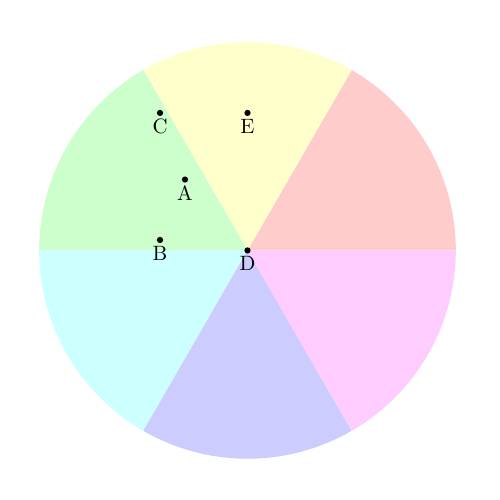
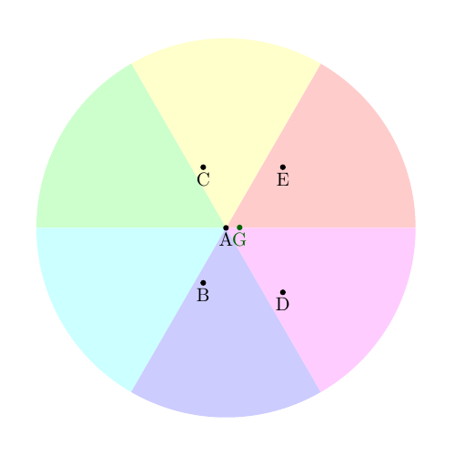
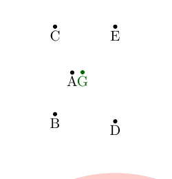
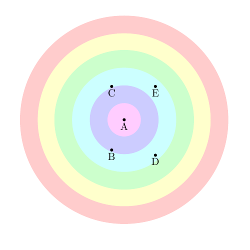
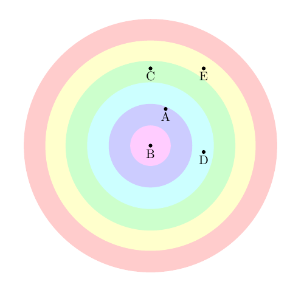

-*- encoding: utf-8; indent-tabs-mode: nil -*-

# DESCRIPTION

## Avant-propos

Le  but  de ce  programme  est  de jouer  au  Mastermind  en tant  que
décodeur, avec un fonctionnement relativement proche de l'optimum.  Le
fonctionnement optimal  s'obtient par  la construction de  l'arbre des
coups possibles, un peu comme aux tic-tac-toe et, en thérorie, aux échecs, puis en analysant cet arbre
pour en  extraire la  suite de coups  qui permettra d'arriver  le plus
rapidement  à  la  découverte  du   code  secret,  quel  que  soit  ce
code. Comme il s'agit  d'une recherche arborescente, cela peut prendre
un temps et un espace  mémoire énormes, même en utilisant des méthodes
comme   l'élagage  alpha-béta.   Ce  programme   utilise   plutôt  des
algorithmes  relativement  économes en  mémoire  et  en  temps et  qui
conduisent à  un résultat en  un nombre de coups  relativement réduit,
même si ce nombre n'est pas minimal.

La description qui suit fait  référence à plusieurs occasions au livre
_Le Mastermind en  10 leçons_, écrit par Marco  Meirovitz (le créateur
du  Mastermind)  et  Jean  Tricot,   publié  par  Hachette  et  achevé
d'imprimer le  15 février 1979,  ISBN 2.01.005031.2. Sur  Internet, on
trouve parfois M. Meirovitz avec le prénom Mordechai au lieu de Marco.
Remarquez  que dans  les  deux  cas, les  initiales  restent "MM".  Je
continuerai à l'appeler  Marco, puisque c'est ce qui est  écrit sur le
livre.

Avertissement pour les mathophobes. Si la simple mention d'un sinus ou
d'un cosinus vous  donne des boutons, arrêtez de lire  ce texte. Il ne
sera  pas  question  de  trigonométrie,  mais de  probabilités  et  de
logarithmes,   ce   qui  est   tout   aussi   nocif   à  votre   santé
psychosomatique.

## Rappel sur les règles du jeu

Le Mastermind  se joue à  deux joueurs, le  codeur et le  décodeur. Le
codeur  choisit un  code secret,  une combinaison  de  quatre couleurs
prises  parmi six,  les  répétitions étant  autorisées.   Il pose  les
quatre  pions correspondant dans  quatre trous,  masqués du  regard du
décodeur par un écran amovible.  Puis le décodeur essaie de deviner le
code secret  en proposant une combinaison  de son choix.   Il pose les
quatre  pions colorés  de sa  proposition dans  quatre  trous alignés,
visibles par  les deux joueurs.   Le codeur compare  cette combinaison
avec son code secret et révèle  au décodeur combien de couleurs sont à
la  bonne place  (ce qui  se matérialise  par des  marques  noires) et
combien de couleurs sont correctes,  mais à une mauvaise place (ce qui
donne des  marques blanches).  Si le décodeur  n'a pas trouvé  le code
secret,  il  effectue un  nouveau  tour,  avec  le choix  d'une  autre
combinaison et  le codeur répond  de même. Le  but du décodeur  est de
trouver le code  secret, ce qui se traduit  par quatre marques noires,
avec le minimum de coups.

Pour  une compétition  équilibrée, les  joueurs échangent  ensuite les
rôles et l'ancien codeur cherche à  décoder un nouveau code choisi par
l'ancien  décodeur. Les  joueurs comparent  le nombre  de tours  de la
première manche  avec celui  de la  seconde manche  pour savoir  qui a
gagné. Cet aspect n'est pas pris en compte dans mon programme.

Si le  jeu physique utilise  des pions  de 6 couleurs  différentes, en
revanche certains programmes  utilisent des symboles `A`  à `F`. C'est
le cas  également de ce texte,  qui pourra ainsi être  affiché en noir
sur blanc. De plus, les navigateurs avec synthèse vocale pourront plus
facilement  traiter mes  explications. Néanmoins,  dans la  suite, les
symboles `A` à  `F` seront appelés « couleurs ». De  même, les marques
noires sont représentées par `X` et les marques blanches par `O`.

Exemple : le codeur a choisi

```
  C F E D
```

et le décodeur propose

```
  A B C D
```

La  note se  constitue  d'une  marque noire  (pour  `D` en  quatrième
position) et d'une marque blanche (pour `C` en première position dans
le  code  et en  troisième  position  dans  la proposition).  Mais  le
décodeur  ne sait pas  quelle couleur  ou quelle  position a  donné la
marque noire ni la marque blanche.

S'il y  a répétition de  couleur, un même  pion ne peut  donner qu'une
seule   marque,   en  privilégiant   les   marques   noires  sur   les
blanches. Exemple :

```
  code secret   D A A D
  proposition   A B C D
```

Le résultat sera une marque noire et  une marque blanche. Le `A` de la
proposition, en position 1, peut être  apparié au `A` en position 2 du
code secret ou à celui qui se trouve en position 3. Dans les deux cas,
cela donne une  marque blanche. Mais cela n'en donne  qu'une seule, le
`A` de la  proposition ne pouvant servir qu'une seule  fois. Le `D` de
la  proposition, en  position  4, peut  être apparié  avec  le `D`  en
position 1  du code secret,  ce qui  donnerait une marque  blanche, ou
avec le `D` en position 4 du  code secret, ce qui donnerait une marque
noire. Dans ce cas, c'est la  marque noire qui l'emporte sur la marque
blanche. Le résultat  complet est donc une marque noire  et une marque
blanche.

Si le codeur  est obligé de choisir ses quatre  couleurs parmi les six
possibles, le  décodeur a le  droit d'insérer dans sa  proposition une
couleur dont  il sait  qu'elle est  invalide. Matériellement,  cela se
traduit  par  une  place  laissée  vide, sans  pion  de  couleur.  Mon
programme n'utilise pas cette possibilité.

Dans le cas d'un texte en noir sur blanc (ce fichier Markdown ou un livre),
on représente traditionnellement les marques noires avec un `X` et les
marques   blanches  avec   un  `O`.   Les  pions   de  couleurs   sont
habituellement  représentés  par l'initiale  de  la  couleur, mais  je
préfère ici  utiliser les lettres de  `A` à `F`, puisque  le programme
permet l'utilisation d'un nombre de couleurs allant jusqu'à 26.

Il  existe des  variantes  du Mastermind.  Des variantes  élémentaires
consistent à faire varier le nombre de trous et le nombre de couleurs.
Elles  sont traitées (dans  des limites  raisonnables) par  le présent
programme.

D'autres variantes sont destinées à simplifier la tâche du décodeur et
ne  requièrent aucun  matériel  supplémentaire. Par  exemple, le  code
secret  doit  contenir quatre  couleurs  différentes, les  répétitions
étant interdites. Ou bien le codeur doit indiquer au décodeur à quelle
position  correspond chaque marque  noire ou  blanche qu'il  pose. Ces
variantes ne sont pas prises en compte dans le présent programme.

Enfin, d'autres variantes changent les mécanismes du jeu :
[utilisation de formes en plus des couleurs](https://boardgamegeek.com/boardgame/3664/grand-mastermind),
[utilisation de lettres](https://boardgamegeek.com/boardgame/5662/word-mastermind),
le code secret  devant être un mot intelligible en  français,
[etc](https://boardgamegeek.com/boardgamefamily/142/game-mastermind).
En plus de la variante standard avec des couleurs,
[la variante utilisant les mots du dictionnaire](#variante--Mastermind-avec-des-mots-intelligibles)
est traitée dans ce projet. Les autres variantes ne sont pas prises en
considération.

## Déroulement d'une partie

Une partie  avec un décodeur  humain se déroule  en trois étapes  : le
début de partie, le milieu de partie et la fin de partie.

Pendant le  début de partie, le  décodeur n'a aucune idée  sur le code
secret à  trouver. Il joue donc  des propositions en  grande partie au
hasard, de manière à « ratisser large ».

En milieu de  partie, le décodeur commence à  avoir quelques idées sur
le code secret,  il formule des hypothèses et  les teste. Par exemple,
il peut  formuler des hypothèses comme  : « Le rouge  est-il répété ou
n'apparaît-il qu'une fois  ? » ou bien : « La  marque noire du premier
tour  correspond-elle au  bleu en  première  position ou  au jaune  en
troisième ? ».

En fin de partie, le décodeur  a des idées précises sur le code secret
et il ne  reste plus que quelques codes compatibles avec  ce qui a été
joué jusque-là.   Le décodeur est  capable d'énumérer la liste  de ces
codes. Son but est alors de  minimiser le nombre de coups à jouer pour
obtenir le  résultat, donc de  choisir dans la  liste le code  le plus
discriminant.  Exemple, les codes  restants sont : `ABCD`, `ABDC` et
`BACD`. Si le décodeur joue `ABCD`, le codeur répondra :

* `XXXX` si le code secret est `ABCD`
* `XXOO` si le code secret est `ABDC` ou `BACD`.

Si en revanche, le décodeur joue `BACD`, le codeur répondra :

* `XXXX` si le code secret est `BACD`,
* `XXOO` si le code secret est `ABCD`,
* `OOOO` si le code secret est `ABDC`.

On voit  donc que `BACD`  (tout comme `ABDC`) mène  à un gain  en deux
coups maximum, alors  que dans un tiers des cas,  `ABCD` conduit à une
fin de partie en trois coups.

Dans le  cas de mon  programme, le milieu  de partie n'existe  pas. Le
programme est capable de mémoriser  une liste de plusieurs milliers de
codes autorisés, ce  que ne peut pas faire un  humain normal.  Donc, à
l'issue  du  début  de   partie,  pendant  un  interlude  (de  "inter"
signifiant "entre" et "lude" signifiant "jeu") le programme établit la
liste  des codes  compatibles avec  ce qui  a déjà  été joué,  puis il
entame la fin de la partie.

Une autre différence entre mon programme et le jeu avec un humain.  Le
programme  considère   que  tous  les   codes  secrets  ont   la  même
probabilité.   Ainsi que  le signalent  les  auteurs du  livre, si  le
codeur est un humain, il évitera inconsciemment certaines combinaisons
de  couleurs  et  en   privilégiera  d'autres.  Également,  les  codes
monochromes sont censés survenir 6 fois sur 1296, ou 1 fois sur 216 si
le codeur est un programme  correctement codé, alors que la proportion
sera nettement moins importante si le codeur est un humain.

Remarque : à cause  d'une tradition, d'une charte  ancienne ou quelque
chose comme  ça, les  parties sont  habituellement présentées  avec le
premier  coup en  bas et  le  dernier coup  en haut.  C'est ainsi  que
procèdent Tricot et Meirovitz dans leur livre, c'est ainsi que je fais
dans la présente documentation.

Autre remarque : parmi les paramètres du programme, il est possible de
donner le nom d'un fichier contenant une liste de mots. Cela permet de
faire fonctionner le programme comme un décodeur pour le
[Mastermind des mots](https://boardgamegeek.com/boardgame/5662/word-mastermind).
Dans ce  cas, il  n'y a pas  de début de  partie ou  d'interlude, mais
simplement un prélude consistant à charger le contenu de ce fichier en
mémoire. Si l'utilisateur a spécifié  un nombre de trous, le programme
filtre le  fichier pour ne  conserver que les  mots dont le  nombre de
lettres  correspond  au nombre  de  trous.  Si l'utilisateur  n'a  pas
spécifié de  nombre de trous, le  programme vérifie que tous  les mots
contenus  dans le  fichier ont  la même  longueur (ce  qui donnera  le
nombre de trous).

## Début de partie

Le  livre de  Jean Tricot  et Marco  Meirovitz analyse  les différents
coups de départ pour le jeu à 4 trous et 6 couleurs et pour le jeu à 4
trous  et 7  couleurs.  Pour le  jeu  à  4 trous  et  6 couleurs,  les
propositions  `ABCD`   et  `ABCC`  sont  quasiment   équivalentes.  En
revanche, pour le  jeu à 4 trous  et 7 couleurs, c'est  le code `ABCD`
qui  est  le  meilleur.   Donc,  par  extrapolation  pifométrique,  je
considère que la meilleure tactique  pour le début de partie lorsqu'il
y a  beaucoup de couleurs consiste  à jouer `ABCD`, puis  `EFGH`, puis
`IJKL` et  ainsi de  suite. Et s'il  n'y a pas  assez de  couleurs, on
boucle. Par exemple, pour  le jeu à 4 trous et  6 couleurs, le premier
coup  est  `ABCD`,  le  deuxième est  `EFAB`,  c'est-à-dire  les  deux
dernières couleurs  `E` et `F`, puis  on reprend au début  avec `A` et
`B` pour compléter le code.

Tout  au long  du début  de partie,  si l'on  tombe sur  un  nombre de
marques à zéro, on supprime  carrément de la liste des couleurs celles
qui apparaissent dans la proposition. Cela accélérera l'interlude.

Il est  important de remarquer  que les codes  joués dans le  début de
partie  n'ont jamais  de  couleur commune,  à part  le  premier et  le
dernier  coup  (celui qui  boucle  sur  la  liste des  couleurs).  Par
exemple, pour  le jeu à 4  trous et 26 couleurs,  les tours successifs
sont `ABCD`, `EFGH`,  `IJKL`, `MNOP`, `QRST`, `UVWX`  et `YZAB`. Seuls
`ABCD` et `YZAB`  ont des couleurs en commun. La  raison pour laquelle
il est important de ne pas avoir de couleur commune est donnée dans la
suite du texte.

Le programme  décide de quitter le  début de partie dans  l'un des cas
suivants :

<ul>

<li>
Lorsqu'il a  obtenu une  note avec 4  noirs, c'est-à-dire  lorsqu'il a
trouvé le code secret. C'est une  victoire due au hasard, certes, mais
il faut la prévoir.
</li>

<li>
Lorsqu'il a  passé en  revue toutes  les couleurs.  On estime  que les
notes des coups passés apporteront suffisamment d'information pour que
la liste de codes compatibles ne soit pas trop longue.
</li>

<li>
Lorsque tous les  codes joués jusque-là ont abouti à  une note cumulée
de 4 marques noires ou blanches. Par exemple :

<pre>
    IJKL OO
    EFGH X
    ABCD O
</pre>

On sait pertinemment  que les codes suivants `MNOP`,  `QRST` et `UVWX`
auront  une note  nulle. Inutile  donc de  les jouer.  On peut  passer
directement à l'interlude, avec la  constitution de la liste des codes
compatibles.
</li>

<li>
Lorsque tous les  codes joués jusque-là ont abouti à  une note cumulée
de 3 marques noires ou blanches. Par exemple :

<pre>
    IJKL O
    EFGH X
    ABCD O
</pre>

Les  codes suivants  `MNOP`, `QRST`  et `UVWX`  ne pourront  avoir que
trois notes possibles : `X`, `O` ou rien du tout. C'est donc une perte
de temps. On passe donc à l'interlude et à la constitution de la liste
des codes compatibles.  Celle-ci sera plus importante que  dans le cas
précédent, mais au moins, on pourra reprendre la fin de partie avec un
éventail  de  notes plus  important,  donc  permettant d'aboutir  plus
rapidement.
</li>

</ul>

La note cumulée s'évalue en créant un « coup synthétique », qui est la
concaténation de  tous les  coups réels ayant  eu au moins  une marque
noire ou  blanche. Pourquoi  prend-on la peine  de constituer  ce coup
synthétique, au lieu de cumuler simplement les résultats `$nb` ? Cela
sera expliqué dans l'interlude.

### Exemple

Si les  explications ci-dessus  ne vous ont  pas permis  de comprendre
comment  fonctionnent les  variables  `@coul` et  `%coup_synthetique`,
voici un exemple qui vous  expliquera le « comment » de ces variables.
Pour  le  « pourquoi », il  faudra  attendre  un peu  plus  longtemps.
L'exemple utilise 4 positions et 26 couleurs.

La variable `%coup_synthetique` est une  table de hachage, avec la clé
`code`  pour la  proposition, la  clé `n`  pour le  nombre de  marques
noires, la clé `b`  pour le nombre de marques blanches  et la clé `nb`
pour  le nombre  de marques  noires et  blanches confondues.  Elle est
initialisée à

```
  %coup_synthetique = (code => '', n => 0, b => 0, nb => 0 )
```

La  variable  `@coul`  (=  « couleurs »)  est  un  simple  tableau  de
caractères  contenant   toutes  les   couleurs  possibles.   Elle  est
initialisée à

```
  @coul = qw<A B C D E F G H I J K L M N O P Q R S T U V W X Y Z>
```

Le premier tour est `ABCD`, qui ne reçoit aucune marque. Tout se passe
comme si l'on avait 22 couleurs possibles au lieu de 26:

```
  @coul = qw<E F G H I J K L M N O P Q R S T U V W X Y Z>
  %coup_synthetique = (code => '', n => 0, b => 0, nb => 0 )
```

Le deuxième tour est `EFGH`, qui reçoit une marque noire et une marque
blanche.

```
  @coul = qw<E F G H I J K L M N O P Q R S T U V W X Y Z>
  %coup_synthetique = (code => 'EFGH', n => 1, b => 1, nb => 2 )
```

Le troisième  tour est `IJKL`,  qui ne reçoit aucune  marque. Nouvelle
simplification :

```
  @coul = qw<E F G H M N O P Q R S T U V W X Y Z>
  %coup_synthetique = (code => 'EFGH', n => 1, b => 1, nb => 2 )
```

Le  quatrième tour  est `MNOP`,  qui reçoit  une marque  noire et  une
marque blanche.  Étant donné que  le coup synthétique n'est  pas vide,
ces deux  marques sont enregistrées  dans le coup synthétique  en tant
que marques blanches :

```
  @coul = qw<E F G H M N O P Q R S T U V W X Y Z>
  %coup_synthetique = (code => 'EFGHMNOP', n => 1, b => 3, nb => 4 )
```

## Interlude

Dans l'interlude,  le programme construit  la liste de tous  les codes
compatibles avec les coups joués pendant le début de partie.  La liste
est construite progressivement avec des  codes incomplets à 1, puis 2,
puis 3 pions, avant d'arriver aux codes complets à 4 pions.

À chaque  étape, on  compare le code  incomplet avec  les propositions
jouées dans le début de partie,  pour voir si les résultats (nombre de
marques noires et nombre de marques blanches) correspondent.  On garde
à l'esprit que le code est incomplet et qu'en ajoutant une couleur, on
peut :

* conserver la note courante,
* obtenir une marque noire supplémentaire,
* obtenir une marque blanche supplémentaire,
* remplacer une marque blanche par une marque noire.

Pour un code à trois couleurs  et un vide, le nombre de marques noires
doit  donc être  le nombre  final, ou  bien le  nombre final  moins 1.
Quant à  tester les  marques blanches, il  est préférable de  faire la
somme noirs+blancs. Ainsi, le nombre  de marques noires et blanches du
code à trois couleurs et un  vide doit être le nombre final de marques
noires et blanches, ou bien ce nombre moins 1.

Pour  un code  à deux  couleurs et  deux vides,  le nombre  de marques
noires  doit être compris  entre le  nombre final  et le  nombre final
moins 2.  Idem pour la somme marques noires + marques blanches.

Et pour  un code  à une seule  couleur  et  trois vides, le  nombre de
marques noires  doit être compris entre  le nombre final  et le nombre
final moins 3.  Et encore une fois, c'est pareil pour le nombre cumulé
de marques noires et blanches.

Ainsi, en commençant  par déterminer les codes à un  seul pion, puis à
deux pions, puis 3 puis 4, on ne parcourt pas l'arbre entier des codes
possibles, on  l'élague au fur  et à mesure,  ce qui permet  de perdre
moins de temps.

Exemples :  l'un des coups  joués était  `ABCD`, noté `X`  (une marque
noire). Le code `AE..` obtient une note `X` et est donc compatible. Le
code  `AD..` obtient  une note  `XO`  et est  incompatible. En  effet,
quelles  que soient  les couleurs  placées en  troisième et  quatrième
positions, on  ne pourra pas  revenir à une  note `X`. Le  code `CE..`
obtient une  note `O` et est  compatible. Bien qu'il y  ait une marque
blanche en  trop, cette  marque pourra être  remplacée par  une marque
noire,  lorsque  l'on testera  `CEC.`  puis  `CECC` et  `CECE`  (entre
autres).

Maintenant, supposons que  le coup `ABCD` ait reçu la  note `XOO` (une
marque noire et  deux blanches). Le code `AE..` reçoit  la note `X` et
est compatible.  En effet, il reste  deux trous à remplir  et ces deux
trous  peuvent  fournir  les  deux  marques  blanches  manquantes.  En
revanche, le code `EF..` reçoit une note nulle et est incompatible. En
effet,  ce n'est  pas  les deux  trous à  remplir  qui permettront  de
fournir les trois marques manquantes.

Remarque : pour des raisons  de simplification du code, le remplissage
se fait par la fin, `...A`  et `...B` etc pour la première génération,
puis `..AA`, `..AB` pour la deuxième génération et ainsi de suite.

### Utilisation du coup synthétique

Autre remarque. Prenons le jeu à  4 trous et 26 couleurs, et supposons
que le début de partie soit le suivant :

```
    IJKL X
    EFGH X
    ABCD X
```

La liste  de premier niveau,  c'est-à-dire de codes avec  trois vides,
comporte  toutes  les lettres  de  l'alphabet  `...A` jusqu'à  `...Z`.
Normal.  La liste  de deuxième  niveau comportera,  entre autres,  des
codes  partiels du  genre `..MN`  ou `..NO`.  Ces codes  partiels sont
compatibles séparément avec  les trois coups joués, mais  pas avec les
trois coups dans  leur globalité. D'accord pour avoir  une couleur `M`
ou au-delà, mais pas deux, car un humain a tout de suite compris qu'il
faut une  couleur parmi  `A`..`D`, une couleur  parmi `E`..`H`  et une
couleur parmi `I`..`L`.  Mais le programme n'est pas  capable de faire
ce   raisonnement.    Heureusement,   grâce   au    coup   synthétique

```
  %coup_synthetique = (code => 'ABCDEFGHIJKL', n => 1, b => 2, nb => 3 )
```

le programme pourra déterminer
qu'il  faut  trois   de  ces  douze  couleurs  dans   le  code  final,
c'est-à-dire au moins une de ces  douze couleurs dans chacun des codes
partiels à deux  vides. Cela permet donc de rejeter  `..MN` et `..NO`.
Mais surtout, cela permet d'élaguer l'arbre de recherche et
de ne  pas prendre en considération tous les coups à un seul vide
générés à  partir de `..MN` et de `..NO`. Le coup synthétique ne
permet pas  de rejeter `..AB`, mais  n'importe comment, ce code  a été
rejeté lorsqu'il  a été confronté au  coup `ABCD` qui avait  une seule
marque (noire).

Le coup synthétique ne doit pas contenir le coup où l'on boucle sur la
liste des  couleurs. Il faut  arrêter d'alimenter le  coup synthétique
juste avant ce coup. Voici un exemple  dans une partie à 6 couleurs où
l'on n'a  pas pris  cette précaution.  La solution  est `ABEE`  et les
premiers coups sont :

```
EFAB OOO
ABCD XX
```

Supposons que le coup synthétique contienne le coup numéro 2 :

```
  %coup_synthetique = (code => 'ABCDEFAB', n => 2, b => 3, nb => 5 )
```

Quoi ? 5 marques pour  un code à 4 positions ? C'est  parce que le `A`
en première position  du premier coup et le `A`  en troisième position
du deuxième  coup ont tous  les deux été  appariés au `A`  en première
position du code. Idem  pour les `B`. Il faut donc  éviter que le coup
synthétique contienne  des couleurs en  double. Pour cette  raison, le
coup qui  boucle sur  la liste  des couleurs doit  être exclu  du coup
synthétique.

Une nouvelle  difficulté se  fait jour, avec  un cas  très particulier
néanmoins  parfaitement valide.  Les _n_  -  1 premiers  coups ont  eu
chacun 0  noir et  0 blanc et  le _n_ ième  coup a  eu 3 ou  4 marques
noires et blanches. Exemple avec une partie à 10 couleurs :

```
IJIJ XOO
EFGH -
ABCD -
```

Le coup synthétique a encore sa valeur initiale :

```
  %coup_synthetique = (code => '', n => 0, b => 0, nb => 0 )
```

Le processus de l'interlude ne  doit pas utiliser ce coup synthétique,
sinon le  programme déclencherait un avertissement  `substr outside of
string` (sous-chaîne en dehors de la chaîne).

De toutes façons, avec le coup `IJIJ`  et avec le fait que la variable
`@coul`  est réduite  à `qw<I  J>`, la  construction des  propositions
compatibles sera très rapide.

Une fois  la liste  des codes construite,  le programme  évalue chaque
code avec  chaque autre, pour stocker  la note dans  un hachage indexé
par ces deux codes. Comme cela sera montré dans la suite, le programme
aura besoin de toutes ces notes  au moins une fois, mais assez souvent
plusieurs fois.

En  fait, c'était  la façon  dont  une ancienne  version du  programme
fonctionnait. Il  est plus simple  d'adapter la fonction  `noter` pour
qu'elle  alimente un  cache et  qu'elle l'utilise  lors d'un  éventuel
deuxième appel avec  les mêmes paramètres. Il faut  toutefois vider le
cache à  la fin de  l'interlude, car cet  interlude a rempli  le cache
entre autres avec des codes partiels  et avec le code synthétique, qui
n'ont plus aucune utilité dans la fin de partie.

## Fin de partie

Un coup de la fin de la partie prend l'allure suivante :

* Le programme  choisit le code  le plus discriminant parmi  les codes
restants,

* Le programme joue ce code,

* Si la note est `XXXX`, fin de la partie

* Sinon, le programme reçoit la note  du codeur et filtre la liste des
codes restants pour éliminer les codes incompatibles avec cette note.

* Si le  tableau à double entrée  `%notes` n'a pas été  généré lors de
l'interlude et si le nombre de  possibilités est retombé en-deçà de la
limite, alors on le génère  maintenant, pour permettre d'accélérer les
appels ultérieurs à la fonction de choix.

L'action de jouer un code et l'action de filtrer les codes restants ne
présentent pas de mystère. Le choix du code le plus discriminant parmi
les  codes restants  est plus  intéressant. Il  y  principalement deux
méthodes. Celle que j'ai connue la première pendant les années 1980 et
qui est  mentionnée dans  le livre de  Jean Tricot et  Marco Meirovitz
repose sur  l'entropie de Shannon. La  seconde, dont j'ai  eu vent fin
2011 en  lisant la doc  de
[Algorithm::MasterMind](https://metacpan.org/pod/Algorithm::MasterMind)
a été  décrite par Donald  Knuth et utilise  le minimax (cela  dit, en
2025 je ne retrouve plus la mention du minimax dans ce module Perl).

### Échantillon de codes restants

Le choix du code le plus  discriminant nécessite une boucle double sur
la liste des  codes restants. Cela peut prendre du  temps, beaucoup de
temps.  Pour éviter  cela, si  la liste  des codes  restants est  trop
importante, on en prend un échantillon et on effectue la double boucle
sur  cet échantillon.  On n'est  pas sûr  d'obtenir le  minimax ou  la
meilleure entropie, mais espérons que l'on ne tombe pas loin.

Le programme définit  une limite du nombre de codes  à tester, dans la
variable `$limite_notes`. Si le nombre de codes restants est inférieur
ou égal à cette limite, le  programme n'échantillonne pas, il prend la
totalité de la liste des codes restants.

Supposons que la  limite soit 100 et que l'on  ait 234 codes restants.
L'échantillon sélectionnera un code tous les 2,34. Il prendra :

* le code d'indice 0,

* le code d'indice 2,34 arrondi à 2,

* le code d'indice 2 × 2,34 = 4,68 arrondi à 4,

* le code d'indice 3 × 2,34 = 7,02 arrondi à 7,

* le code d'indice 4 × 2,34 = 9,36, arrondi à 9

et  ainsi  de  suite.  L'échantillon est  mémorisé  dans  la  variable
`@echantillon_poss`.

La partie à 26 couleurs suivante :

```
  IJKL O
  EFGH O
  ABCD O
```

donne 9270 possibilités.  En adoptant une limite  d'échantillon à 2000
codes, le programme  effectue 4 milllions d'itérations  dans la double
boucle  au  lieu de  85  millions.  Sur  ma  machine, cela  prend  une
vingtaine de secondes.

Attention au piège, toutefois. Soit la partie suivante, avec 26 couleurs

```
IJKL O
EFGH O
ABCD O
```

La fin de l'interlude et le début de la fin de partie donnent :

```
9720 codes
07:35:13 début du choix
Liste des possibilités échantillonnée (1 sur 4.86)
meilleure entropie RAJG avec 2.33432868885235 (max : 782)
son histogramme : XXXX: 1, XXX: 4, XXO: 10, XX: 56, XOOO: 1, XOO: 24, XO: 133, X: 272, OOO: 12, OO: 182, O: 523, (rien): 782
minimax FRBJ avec 725 (entropie 2.25283449338101)
son histogramme : XXXX: 1, XXX: 2, XXOO: 2, XXO: 5, XX: 52, XOOO: 1, XOO: 9, XO: 112, X: 313, OOO: 9, OO: 157, O: 612, (rien): 725
07:35:33 fin du choix
4 : je joue RAJG
```

L'histogramme de `RAJG`  ne concerne que l'échantillon  de 2000 codes.
Si l'on répond `XX` (ou `2 0`), il restera 218 possibilités et non pas
56. Si l'on répond `0 0`, on n'aura pas 782 possibilités, mais 3883.

### L'entropie de Shannon

Au début, l'entropie a été un concept en physique, plus précisément en
thermodynamique.    L'entropie   a   été   introduite   par   Clausius
(1822--1888)  comme étant  le quotient  de la  quantité de  chaleur du
système  considéré par  sa température  absolue.  Cette  notion  a été
développée  par Ludwig  Boltzmann (1844--1906)  qui l'a  décrite comme
étant le  nombre de micro-états définissant le  macro-état du système.
Shannon  (1916--2001)  a repris  cette  notion  en mathématiques  pour
étudier le codage  optimal d'un message transmis par  un canal avec ou
sans parasites. La formule qu'il donne est

$$
S = - \sum p_i \times \log_2(p_i)
$$

Jean Tricot et Marco Meirovitz  ont appliqué ce concept au Mastermind,
mais sans  vraiment donner  de détails et sans même utiliser le terme
« entropie ».  Voici  une explication  de la
notion  d'entropie mathématique.  Cela ne  constitue pas  un  cours de
mathématiques en bonne et due  forme, c'est plutôt une présentation de
mathématiques expérimentales faisant  appel à l'intuition plutôt qu'au
raisonnement.

Laissons de côté le Mastermind et prenons un autre jeu sur le principe
des  questions-réponses, le  jeu consistant  à deviner  un  nombre. Le
codeur choisit secrètement un nombre entre 1 et 100 et le décodeur lui
propose un  nombre, par exemple 50.  Le codeur doit  alors répondre si
c'est  ce nombre,  ou bien  un nombre  plus petit,  ou bien  encore un
nombre plus  grand. Maintenant, modifions légèrement les  règles de ce
jeu. D'une  part, le  nombre à deviner  est dans  l'intervalle 0..255,
d'autre part les questions sont en format libre.

Le décodeur commence par la question : « Le nombre se trouve-t-il dans
l'intervalle 0..127 ou dans l'intervalle  128..255 ? » Dans un cas sur
deux, il  apprendra que le bit  de poids fort  est 0, dans un  cas sur
deux il apprendra  que c'est 1. Avec les  deux réponses de probabilité
1/2, le décodeur gagnera donc 1 bit.

Supposons  maintenant que  sa première  question  soit :  « Le  nombre
est-il pair  ou impair ? ». Là  encore l'une ou l'autre  réponse a une
probabilité de  1/2 et l'une ou  l'autre fait gagner un  bit, sauf que
c'est le bit de poids faible.

Et maintenant, le  décodeur commence la partie par la  question : « Le
nombre se  trouve-t-il dans l'intervalle  0..63 ? ». S'il  obtient une
réponse affirmative, il aura gagné deux bits. Mais cette réponse a une
probabilité de 1/4. Ou bien alors,  il pourrait même commencer par : «
Est-ce 23 ? » et cette réponse, de probabilité 1/256 lui ferait gagner
8 bits d'un seul coup.

Et  s'il demande  maintenant :  « Le  nombre est-il  dans l'intervalle
0..84 ? », une réponse affirmative lui permet de connaître précisément
le bit  de poids  fort et  d'avoir de fortes  présomptions sur  le bit
suivant. En tout état  de cause le nombre commence par `0`  et il y a
de fortes chances qu'il commence par  `00`. Il a donc gagné plus d'un
bit,  mais  pas  tout-à-fait  2.  On  va dire  que  cette  réponse  de
probabilité 1/3  lui a fait gagner  1,58 bit. On en  déduit le tableau
suivant :

  | probabilité de la réponse | information obtenue    |
  |:----------:|:----------:|
  |    1/2     |   1 bit    |
  |    1/4     |   2 bits   |
  |    1/256   |   8 bits   |
  |    1/3     | 1,58 bit   |
  |    p_i     | -Log_2(p_i)|

Une question peut  être considérée comme un éventail  de réponses plus
ou  moins probables. Supposons  que la  première question  du décodeur
soit  : «  Le  nombre  se trouve-t-il  dans  l'intervalle 0..63,  dans
l'intervalle 64..127  ou dans l'intervalle  128..255 ? ».  La première
réponse  lui fournit  2 bits  avec  une probabilité  1/4. La  deuxième
réponse  lui fournit  aussi  2 bits  avec  une probabilité  1/4 et  la
troisième  réponse lui  fournit 1  bit  avec une  probabilité 1/2.  Le
décodeur récoltera en moyenne  1/4 x 2 + 1/4 x 2 + 1/2  x 1 = 1,5 bit.
Plus généralement,  si les probabilités des  différentes réponses sont
$p_i$, alors la quantité d'information moyenne obtenue par la question
est :

$$
S = - \sum p_i \times \log_2(p_i)
$$

Pour faire  pédant, signalons que  l'on peut utiliser  les logarithmes
népériens dans la formule à la  place des logarithmes à base deux.  On
ne peut plus parler de bits dans ce cas. L'unité est alors appelé le «
shannon ». Cette unité de quantité d'information n'est jamais utilisée
dans  la  réalité,  y  compris  pour  les  études  théoriques  sur  la
transmission de l'information.

Revenons au Mastermind. Une question consiste à jouer une proposition,
`ABCD` ou `BACD`  par exemple. La réponse est l'une  des notes `XXXX`,
`XXOO`, `XXX.`, `XOO` et ainsi de  suite. La probabilité de chacune de
ces  réponses   est  proportionnelle   au  nombre   de  codes   qui  y
correspondent. On peut ainsi calculer l'entropie de la question.

Reprenons l'exemple du début. Les codes restants sont : `ABCD`, `ABDC`
et `BACD`. En fonction de la  question du décodeur, le codeur répondra :

```
  +----------+----------+--------------+-------------+------------+
  | Question | Réponses | Codes        | Probabilité | Entropie   |
  +----------+----------+--------------+-------------+------------+
  |   ABCD   |   XXXX   | ABCD         |    1/3      |            |
  |          +----------+--------------+-------------+            |
  |          |   XXOO   | ABDC et BACD |    2/3      |  0,92 bit  |
  +----------+----------+--------------+-------------+------------+
  |   BACD   |   XXXX   | BACD         |    1/3      |            |
  |          +----------+--------------+-------------+            |
  |          |   XXOO   | ABCD         |    1/3      |            |
  |          +----------+--------------+-------------+            |
  |          |   OOOO   | ABDC         |    1/3      |  1,58 bit  |
  +----------+----------+--------------+-------------+------------+
  |   ABDC   |   XXXX   | ABDC         |    1/3      |            |
  |          +----------+--------------+-------------+            |
  |          |   XXOO   | ABCD         |    1/3      |            |
  |          +----------+--------------+-------------+            |
  |          |   OOOO   | BACD         |    1/3      |  1,58 bit  |
  +----------+----------+--------------+-------------+------------+
```

On voit  donc que le code  `BACD` et le code  `ABDC` rapportent plus
d'information que `ABCD`.  C'est donc ce que le programme de décodage
jouera.

Si  les probabilités  sont calculées  à  partir de  la partition  d'un
ensemble  de  $N$  éléments  en classes  de  $n_i$  éléments  chacune,
c'est-à-dire que $p_i = \frac{n_i}{N}$ avec $N = \sum n_i$,
alors, après quelques transformations de niveau terminale scientifique,
l'entropie se calcule avec :

$$
S = \log_2 \left( N \right) - \frac{ \sum n_i \times \log_2\left(n_i\right)}{N}
$$

### Le minimax de Knuth

Ce  critère est  nettement plus  simple  (et beaucoup  moins rigolo  à
expliquer). Lorsque  l'on recense  les différentes notes  obtenues par
les  codes possibles  restants,  on  se contente  de  retenir la  note
correspondant au nombre maximal de codes possibles. Et le code à jouer
est  celui pour  lequel ce  maximum est  le plus  petit. Avec  le même
exemple que ci-dessus, on a :

```
  +----------+----------+--------------+--------+---------+
  | Question | Réponses | Codes        | Nombre | Maximum |
  +----------+----------+--------------+--------+---------+
  |   ABCD   |   XXXX   | ABCD         |    1   |         |
  |          +----------+--------------+--------+         |
  |          |   XXOO   | ABDC et BACD |    2   |    2    |
  +----------+----------+--------------+--------+---------+
  |   BACD   |   XXXX   | BACD         |    1   |         |
  |          +----------+--------------+--------+         |
  |          |   XXOO   | ABCD         |    1   |         |
  |          +----------+--------------+--------+         |
  |          |   OOOO   | ABDC         |    1   |    1    |
  +----------+----------+--------------+--------+---------+
  |   ABDC   |   XXXX   | ABDC         |    1   |         |
  |          +----------+--------------+--------+         |
  |          |   XXOO   | ABCD         |    1   |         |
  |          +----------+--------------+--------+         |
  |          |   OOOO   | BACD         |    1   |    1    |
  +----------+----------+--------------+--------+---------+
```

On voit que  comme avec l'entropie de Shannon, il  ne faut surtout pas
jouer `ABCD`, mais soit `BACD`, soit `ABDC`.

Dans un cas aussi simple, ce  n'est pas étonnant que les deux critères
aboutissent au même résultat. Dans un cas plus compliqué, cela ne sera
pas toujours  le cas. Ainsi, en  annexe de leur livre,  Jean Tricot et
Marco  Meirovitz analysent  le premier  coup  du jeu  à 4  trous et  6
couleurs. Le  coup `ABCD`  possède la  meilleure entropie,  3,05 bits,
mais pour un nombre maximal de 312 codes avec la note `OO`, tandis que
le coup `ABCC` est meilleur pour le critère de Knuth, la note la moins
bonne, `O` donnant 276 possibilités restantes, alors que l'entropie de
Shannon pour  `ABCC` est moins bonne,  3,04 bits. Un centième  de bit,
cela ne va pas  chercher très loin, mais le résultat  est là, ces deux
critères ne sont pas forcément en accord.

Quel est  le meilleur  critère ?  Je ne  sais pas.  Je pense  que cela
dépend des circonstances  et que l'entropie se  révèlera meilleure que
le  minimax  dans certains  cas  tandis  que  le minimax  se  révèlera
meilleur que l'entropie dans d'autres  cas. Pour prendre une métaphore
sportive ou wargamesque, on peut  dire que Shannon joue pour remporter
la victoire, tandis que Knuth joue  pour éviter la défaite. Notons que
l'on n'est  pas obligé d'utiliser la  même méthode tout au  long d'une
même partie. On peut jouer un coup  avec le minimax et le suivant avec
l'entropie. Cela dit, mon programme  utilise le même critère d'un bout
à l'autre d'une même partie.

En fait, j'utilise  les deux critères. L'un est  le critère principal,
l'autre sert à  départager les ex-aequo.  Cela ne  sert vraiment pas à
grand-chose lorsque le critère  principal est l'entropie calculée avec
une  dizaine de  décimales ou  plus (soit  largement plus  que  ce qui
serait  significatif).   Si  deux   codes  ont  la  même  entropie  au
dix-milliardième  de  bit  près,  il  est  quasiment  certain  que  la
répartition  des notes sera  identique pour  ces deux  propositions et
donc, a fortiori,  la classe la plus peuplée  pour les partitions aura
le même nombre d'éléments.   En revanche, lorsque le critère principal
est  le  minimax,  l'utilisation  de l'entropie  pour  départager  les
ex-aequo se révèle utile.

### Remarque : utiliser des codes déjà éliminés

L'une des hypothèses que j'ai faites était que l'on pouvait limiter la
recherche  des codes  les  plus  discriminants à  la  liste des  codes
compatibles avec  le début de  la partie. Je  ne doutais pas  que l'on
pouvait avoir une meilleure discrimination  avec un code qui ne figure
pas  dans  la  liste des  codes  possibles,  mais  je croyais  que  la
différence  n'était  jamais  très  grande  entre  le  code  obtenu  en
cherchant uniquement parmi les codes  compatibles et le code obtenu en
cherchant  dans   la  liste  complète  des  codes   autorisés.  Je  me
trompais.  Prenons l'exemple d'un  jeu à  4 trous  et 26  couleurs. Le
premier tour est :

```
  ABCD XXX
```

Le  programme abandonne  les  codes suivants  `EFGH`, `IJKL`,  `MNOP`,
`QRST`, `UVWX` et `YZAB`, passe à  l'interlude et obtient une liste de
100 codes.  Avec une  notation semblables aux  expressions régulières,
ces 100 codes  sont `ABC[^D]` (25), `AB[^C]D` (25),  `A[^B]CD` (25) et
`[^A]BCD`  (25).  Parmi  ces  100  codes, les  88  qui  n'ont  pas  de
répétitions sont tous identiques pour la répartition des notes

```
  XXXX: 1, XXX: 24, XXO: 3, XX: 72
```

et donc pour la valeur en bits  (1.05) et pour la valeur minimax (72).
Le  programme joue  donc `ABCE`  et supposons  qu'il obtienne  la note
`XXX`. Les codes  compatibles ne sont plus que  24, `ABC[A-CF-Z]`. Ils
sont tous équivalents, avec une répartition

```
  XXXX: 1, XXX: 23
```

Avec  la méthode  consistant à  prendre le  code le  plus discriminant
parmi les codes  possibles, il faudra essayer les 23  codes un par un,
jusqu'à obtenir le code secret. Alors qu'avec d'autres codes, tels que
`FGHI` ou `IJKL`,  on peut éliminer quatre codes de  la liste à chaque
fois (ou, avec un peu de chance, éliminer tous les codes sauf quatre ;
mieux, comme le résultat peut être  `X` ou `O`, la liste résultante ne
comportera pas 4 codes, mais 1 ou 3).

Il faut donc admettre des codes  invalides. Pour ne pas tomber dans un
calcul très  long, on ne va  pas admettre les $26^4$  codes possibles,
mais on  va se contenter des  codes qui auraient été  utilisés lors du
début de partie, s'il n'avait pas été interrompu subitement.

Cela veut-il dire que la décision  d'arrêter le début de partie dès le
premier  tour était  mauvaise, puisque  l'on utilisera  les codes  qui
auraient été utilisés avec un début de partie plus long ? Non, car ces
codes restent quand  même en compétition avec  les codes `ABC[A-CF-Z]`
de  la  liste  des  codes  possibles.  On  prendra  le  code  le  plus
discriminant. Qui sera `IJKL` dans  le cas de l'exemple, ex-aequo avec
`MNOP`, `QRST`  et `UVWX`. Mais  dans d'autres parties,  cela pourrait
être l'un des codes compatibles.

### Fonctionnement du cache

Le fonctionnement basique est le suivant. Lorsque le programme appelle
la fonction `noter`  pour comparer les propositions  `ABCD` et `BDEF`,
la  fonction `noter`  commence  par chercher  si  le hachage  `%notes`
contient un élément `$notes{ABCD}{BDEF}`.  En cas d'échec, la fonction
cherche  l'élément `$notes{BDEF}{ABCD}`.  Si cette  deuxième tentative
échoue, la fonction effectue le calcul du nombre de noirs et du nombre
de blancs, puis stocke le résultat dans `$notes{ABCD}{BDEF}`.

Premier cas particulier. Pendant  l'interlude, le programme appelle la
fonction `noter` avec des codes  partiels et avec le coup synthétique,
qui ne seront pas utilisés  ultérieurement. Le cache peut contenir par
exemple :

```
$notes{ABCD}{'...A'}
$notes{ABCD}{'..AA'}
$notes{ABCD}{'...B'}
$notes{ABCDEFGHIJKL}{'...A'}
$notes{ABCDEFGHIJKL}{'..AA'}
```

Certains  éléments font  intervenir un  coup réel  du début  de partie
(`ABCD`, `EFGH`, ...) avec une proposition complète qui sera ajoutée à
la variable  `@poss`. Même ces  éléments sont inutiles. En  effet, les
coups du  du début de  partie ne seront pas  utilisés après la  fin de
l'interlude. En conséquence,  le cache est complètement vidé  à la fin
de l'interlude.

Deuxième cas particulier.  Pendant la fin de partie, il  y a une étape
de  filtrage,  qui  supprime  les  possibilités  qui  viennent  d'être
invalidées par le dernier coup. Pour bien faire, il faudrait supprimer
les éléments correspondants  du cache. Supposons que  le code supprimé
soit `BCBF`. Ce code peut apparaître en première position de la double
clé ou en deuxième position :

```
$notes{BCBF}{AEDF}
$notes{BCBF}{BADE}
$notes{CDAF}{BCBF}
$notes{AADF}{BCBF}
```

La  fonction `filtrer`  supprime les  éléments  où le  code figure  en
première position, car il suffit d'un simple

```
delete $notes{BCBF};
```

pour supprimer les éléments `$notes{BCBF}{AEDF}`, `$notes{BCBF}{BADE}`
et similaires  en une seule  instruction. En revanche,  pour supprimer
`$notes{CDAF}{BCBF}`,  `$notes{AADF}{BCBF}` et  associés, il  faudrait
effectuer  une boucle,  ce  qui  ferait perdre  du  temps. On  préfère
gaspiller de la place. Surtout  que cette place sera récupérée lorsque
`CADF` et `AADF` seront éliminés par le filtre.

De la même manière, une fois qu'un  code est joué et que le filtre est
terminé,  les enregistrements  du cache  contenant ce  code joué  sont
inutiles.  Le sous-programme  `filtrer` élimine  donc les  éléments du
cache où le code joué figure au niveau 1.

## Variante : Mastermind avec des mots intelligibles

Dans ce dépôt, les codes sont des arrangements de 4 ou 5 lettres, sans
aucune signification intelligible. Il existe une
[variante](https://boardgamegeek.com/boardgame/5662/word-mastermind)
de  Mastermind où  les mots  doivent être  des mots  existant dans  un
dictionnaire donné.

Le programme  a été  adapté pour récupérer  la liste  des possibilités
dans un fichier texte. Ainsi, il n'y a plus d'ouverture et l'interlude
devient un prélude.

À titre d'expérience, j'ai essayé avec la
[liste de mots](https://github.com/ascherer/sgb/blob/master/words.dat)
de [Stanford GraphBase](https://www-cs-faculty.stanford.edu/~knuth/sgb.html),
avec les mots utilisés dans le jeu Master Mot de la revue Télé 7 Jeux
(cf. [un autre projet](https://github.com/jforget/apl-Master-Mot/blob/master/master.fr.md))
et avec la liste de mots français fournie par
[Freelang.com](https://www.freelang.com/).

La liste  de mots  de Stanford  GraphBase comporte  5757 mots,  ce qui
représente 12,5 bits. Pour un jeu avec des marques noires et blanches,
le  meilleur mot  est « tares »  donnant 3,39  bits ou  bien « tales »
donnant le minimax  de 924 mots. Pour un jeu  avec des marques noires,
mais sans marques blanches, le meilleur mot est « cares » donnant 1,60
bit ou « bares » donnant un minimax de 2331 mots.

La liste de  mots des problèmes Master Mot de  T7J comporte 1569 mots,
ce qui  représente 10,6 bits. Pour  un jeu avec des  marques noires et
blanches, le  meilleur mot  est « SERIE »  donnant une  information de
3,22 bits  et un  minimax de 277  mots. Pour un  jeu avec  des marques
noires,  mais sans  marques blanches,  le meilleur  mot est  « PANEE »
donnant  1,60 bit  et un  minimax de  665 mots.  Mais à  moins d'avoir
recopié  (à titre  personnel) les  mêmes  problèmes que  moi, vous  ne
pourrez pas reproduire exactement le même test.

Parmi les 930  mots de 4 lettres  de la liste de  mots de Freeland.com
(soit  9,86 bits),  le  meilleur est  « RAIE » avec  2,92  bits et  le
minimax de  199 mots (règles avec  pions noirs et blancs)  ou « PARE »
avec 1,54  bit et « SOIE »  avec le minimax  de 421 mots  (pions noirs
seulement). Pour les  1939 mots de 5 lettres (soit  10,92 bits), c'est
« SERIE » avec  3,33 bits  et « PORTE »  pour le  minimax de  801 mots
(pions noirs et blancs) ou « CARTE », « PERTE » et « PORTE » avec 1,69
bits et « CAIRE » avec le minimax de 770 mots (pions noirs seulement).

Remarque : dans la  liste de mots de Freeland.com, il y  a en fait 993
mots de  4 lettres,  en supposant que  « gène », « gêne »  et « gêné »
sont trois mots  différents. Pour les besoins du  Mastermind des mots,
ces trois mots sont fusionnés en un seul, « GENE ».

En utilisant  les mots de 4  lettres de la liste  Freeland.com, le mot
provoquant  la partie  la  plus longue  est  « RAYE », nécessitant  10
coups.  Comme  indiqué  ci-dessus,  le premier  coup  utilise  le  mot
« RAIE ».  La note  obtenue est  `XXX`, ce  qui donne  16 possibilités
réparties en trois cliques :

1. BAIE, HAIE, PAIE, TAIE

2. RACE, RADE, RAGE, RAME, RAPE, RARE, RASE, RATE, RAYE

3. RAID, RAIL, RAIS

Voir en [annexe 2](#Annexe-2--notion-de-clique) la notion de clique.

Le deuxième tour  utilise le code « RADE », qui  permet d'éliminer les
cliques 1  et 3 et  de réduire la  clique 2 à  8 mots. Ensuite,  les 8
coups suivants consistent  à tester individuellement chaque  mot de la
clique, jusqu'à trouver le bon.

On peut  noter également que la  liste Freeland.com a oublié  les mots
« RALE » et « RAVE ». Si ces deux mots avaient figuré dans la liste de
mots, la partie aurait duré 12 coups.

Ce problème est similaire à celui
[que j'ai déjà évoqué](#Remarque--utiliser-des-codes-déjà-éliminés)
pour le  Mastermind des  couleurs. Il avait  été résolu  en conservant
dans la  fin de  partie les  codes utilisés  dans l'ouverture.  Ici ce
n'est pas  possible, il  n'y a  pas d'ouverture, donc  on ne  peut pas
récupérer les  codes de  l'ouverture. Les codes  à jouer  doivent être
présents dans le  dictionnaire utilisé, donc il est  impossible de les
générer automatiquement.

La solution  consiste à choisir  quelques codes permettant  de scinder
les cliques  les plus longues, puis  à créer un fichier  contenant les
codes   d'accélération.  Ensuite,   lors  de   l'appel  du   programme
`decodeur-mm`, l'utilisateur spécifie le  chemin d'accès de ce fichier
dans le paramètre `--accel`. Le  programme charge alors ces codes dans
la variable `@suppl`,  déjà utilisée pour le  Mastermind standard avec
des couleurs. Ce fichier peut contenir des commentaires pour justifier
la présence des différents codes. Par exemple

```
GARS  # pour la clique  RACE  RADE *RAGE* RAME   RAPE *RARE* *RASE* RATE RAYE
CAMP  # pour la clique *RACE* RADE  RAGE *RAME* *RAPE* RARE   RASE  RATE RAYE
BACHE # pour la clique *BELER* *CELER* FELER GELER *HELER* MELER
```

Comme on peut le voir, il est  possible de mélanger des codes pour des
longueurs différentes. En revanche, il  n'est pas possible de mélanger
des codes  accélérateurs pour des dictionnaires  différents. Ou alors,
il  faudrait que  les codes  utilisés  soient corrects  pour les  deux
langues.

Avec les  deux codes accélérateurs  à quatre lettres, la  recherche de
« RAYE » s'effectue en 6 coups au lieu de 10. Les codes d'accélération
ne sont utiles que pour  des cliques suffisamment longues. Utiliser un
code  d'accélération pour  une clique  de  3 mots  est inutile,  voire
défavorable.

### Listes de mots

Ainsi que je l'ai déjà marqué,  j'ai récupéré la liste de mots anglais
à 5 lettres créée par D. Knuth pour _The Stanford Graphbase_. Dans le
[dépôt Github](https://github.com/ascherer/sgb),
il  est  marqué  que  le  fichier est  copyright  (c)  1993,  Stanford
University,  que  le  fichier  peut être  copié  librement,  mais  pas
modifié. Dans la
[page web de D. Knuth](https://www-cs-faculty.stanford.edu/~knuth/sgb.html),
il  est marqué  que ce  fichier  (ainsi que  les autres)  est dans  le
domaine public. Le fichier fourni dans cette page n'est pas trié, donc
je l'ai trié avant de l'utiliser dans les parties de Word Mastermind.

Pour le français, j'ai utilisé la
[liste de 22735 mots français](https://www.freelang.com/dictionnaire/dic-francais.php)
de longueurs variées, fournie par
[Freelang.com](https://www.freelang.com/).

Le  mainteneur du  site indique  que  cette liste  de mots  est, à  sa
connaissance, libre de droits (ce qui  n'est pas forcément le cas pour
les autres dictionnaires proposés). La liste a quelques défauts ou
inconvénients. Par exemple :

* présence d'expressions en plus des mots, comme « agir en maître » ou
« anémone de mer »,

* mots qui sont  différents tant que l'on garde les  accents, mais qui
sont  identiques  dès  qu'on  supprime ces  accents,  comme  « gène »,
« gêne »  et « gêné »  (ce  n'est pas  un défaut,  au  contraire ;  en
revanche c'est  un inconvénient  compte tenu  de l'utilisation  que je
veux en faire),

* incohérence pour  les formes accordées, ainsi  nous avons « abonné »
(MS),  « abonnée » (FS)  et  « abonnés » (MP),  mais pas  « abonnées »
(FP),

* idem pour les formes conjuguées des verbes.

Mais le gros mérite de cette liste est d'exister. Merci.

J'ai trouvé un
[autre site](https://www.listesdemots.net/accueil.htm)
proposant des  listes de mots  français, mais  il est moins  commode à
télécharger. Comme j'avais déjà une liste de mots, je n'ai pas fouillé
ce  site et  en  particulier,  je ne  connais  pas  les conditions  de
copyright et de licence.

Également, il y a d'autres sites proposant des listes de mots, mais je
n'ai pas poussé plus avant mes recherches.

## Comparaison entre l'entropie et le minimax

Le  sous-répertoire `exploration`  contient  quelques programmes  pour
effectuer une  exploration exhaustive des deux  algorithmes pour telle
ou telle  configuration. Pour  chaque solution possible,  le programme
`explore.pl` lance une  partie avec l'algorithme de  l'entropie et une
autre partie avec l'algorithme du minimax et compte le nombre de coups
pour chacune. Le résultat est stocké dans une base de données SQLite.

Il va de soi  que cela prend du temps. C'est  tout de même supportable
pour  le Mastermind  standard  :  3 minutes  et  demie  pour les  1296
solutions du  Mastermind à 4 trous  et 6 couleurs, 6  minutes et demie
pour les  2401 solutions  du Mastermind  à 4 trous  et 7  couleurs. En
revanche, c'est beaucoup  plus lent pour le Mastermind des  mots : une
dizaine  de secondes  pour  _chacun_  des 930  mots  de  4 lettres  de
`freelang.com`, presque  une minute pour  _chacun_ des 1939 mots  de 5
lettres de `freelang.com`  ou _chacun_ des 5757 mots  de _The Stanford
Graphbase_. C'est dû  au fait que pour chaque lancement  de partie, le
programme  `decodeur-mm`  est obligé  de  lire  le fichier  séquentiel
contenant   les  mots   autorisés.  J'aurais   peut-être  pu   adapter
`decodeur-mm` pour permettre l'enchaînement  de plusieurs parties sans
avoir besoin  de relire  le fichier dictionnaire.  Ce n'est  pas fait.
Tant  pis.  Avec   un  peu  de  patience,  j'ai   les  résultats  pour
`freelang.com` et pour _The Stanford Graphbase_.

Pour  le  Mastermind des  mots,  l'exploration  a été  effectuée  sans
utiliser les mots d'accélération permettant de scinder les cliques.

La première requête SQL utilisée est :

```
  select config, max(entropy) as max_ent
               , max(minimax) as max_mm
               , avg(entropy) as avg_ent
               , avg(minimax) as avg_mm
  from Code
  group by config
```

Le résultat est :

| config | max_ent | max_mm | avg_ent          | avg_mm           |
| :----- | ------: | -----: | :--------------- | :--------------- |
| fr4    |      10 |     10 | 4.74838709677419 | 4.78172043010753 |
| fr5    |       9 |      8 | 4.52294997421351 | 4.53945332645694 |
| s4c6   |       7 |      6 | 4.49691358024691 | 4.52546296296296 |
| s4c7   |       7 |      7 | 4.8350687213661  | 4.87213660974594 |
| sgb-s  |      11 |     12 | 5.17960743442765 | 5.24943546986278 |

Comme on peut le constater,  l'entropie donne en moyenne des résultats
très légèrement meilleurs (c'est-à-dire  plus rapides) que le minimax.
Cela va chercher  dans les centièmes de tours de  jeux. Même au niveau
du dixième de  tour, les deux algorithmes sont  équivalents en moyenne.

Le pire des cas pour les  deux algorithme est équivalent pour les mots
français de 4 lettres  et pour le Mastermind à 4  trous et 7 couleurs.
Pour les mots français de 5 lettres et pour le Mastermind à 4 trous et
6 couleurs, le pire des cas donne l'avantage au minimax. Pour les mots
anglais de 5 lettres (_Stanford Graphbase_ après tri), le pire des cas
donne l'avantage à l'entropie.

La deuxième requête sert à compter le nombre de solutions pour lesquel
le temps de  recherche diffère entre les deux  algorithmes. La requête
est :

```
  select   config, count(*)
                 , 'minimax faster'       as 'faster_algo'
                 , avg(entropy)           as avg_ent
                 , avg(minimax)           as avg_mm
                 , max(entropy - minimax) as diff
  from     Code
  where    entropy > minimax
  group by config
  union
  select   config, count(*)
                 , 'entropy faster'
                 , avg(entropy)
                 , avg(minimax)
                 , max(minimax - entropy)
  from     Code
  where    entropy < minimax
  group by config
  order by config, faster_algo
```

Le résultat est :

| config | count(*) | faster_algo    | avg_ent          | avg_mm           | diff |
| :----- | -------: | :------------- | :--------------- | :--------------- | ---: |
| fr4    |    193   | entropy faster | 4.11917098445596 | 5.41450777202073 |    4 |
| fr4    |    162   | minimax faster | 5.38888888888889 | 4.03703703703704 |    4 |
| fr5    |    571   | entropy faster | 3.82136602451839 | 5.07005253940455 |    4 |
| fr5    |    565   | minimax faster | 5.13805309734513 | 3.93274336283186 |    5 |
| s4c6   |    223   | entropy faster | 3.94618834080717 | 5.0762331838565  |    3 |
| s4c6   |    195   | minimax faster | 5.05641025641026 | 3.95384615384615 |    3 |
| s4c7   |    439   | entropy faster | 4.29840546697039 | 5.46924829157175 |    3 |
| s4c7   |    365   | minimax faster | 5.41917808219178 | 4.25479452054795 |    3 |
| sgb-s  |   1853   | entropy faster | 4.5763626551538  | 5.88828926065839 |    8 |
| sgb-s  |   1555   | minimax faster | 5.87652733118971 | 4.57170418006431 |    7 |

Ainsi que vous pouvez le voir,  pour chaque variante de Mastermind, le
nombre de solutions indique que  l'avantage est à l'entropie. Les deux
colonnes `avg_ent` et `avg_mm` ne donnent rien d'intéressant, en fait.

En  revanche,  la  colonne  `diff` donne  des  résultats  surprenants,
surtout pour le Mastermind des mots. Une même réponse peut donner lieu
à un nombre de coups très  différent selon que l'on utilise l'entropie
ou le  minimax. L'exemple  extrême est le  mot `TEARS`  (_The Stanford
Graphbase_), trouvé dès le second coup avec l'entropie et requérant 10
coups pour  une recherche avec  le minimax. Il y  a une bonne  part de
chance dans  cet exemple. En  effet, au  premier tour, compte  tenu de
l'échantillonnage,  la  proposition  avec la  meilleure  entropie  est
`TARES`, un anagramme de `TEARS`.  Et comme le programme joue `TARES`,
la seule  proposition avec une  note `XXOOO` est la  réponse cherchée,
`TEARS`. En  revanche, compte tenu de  l'échantillonnage, la meilleure
proposition pour  le minimax est  `RACES`. Dans  le cas de  la réponse
`XOOO`, le premier  coup laisse 45 possibilités, dont la  clique de 11
mots :

```
BEARS DEARS FEARS GEARS HEARS NEARS PEARS SEARS TEARS WEARS YEARS
```

et il faudra 9 essais pour trouver la réponse finale `TEARS`.

Dans l'autre  sens, nous avons `SALES`,  trouvé en deux tours  avec le
minimax  (premier tour  `RACES`) et  en  9 tours  avec l'entropie.  Là
encore,  le nombre  de  tours est  dû  à une  clique.  Après les  deux
premiers tours utilisant l'entropie (`TARES`  et `DALES`), il reste 11
possibilités,  avec une  clique de  deux, `DAMES`  et `DAZES`,  et une
clique de 10 mots :

```
BALES GALES HALES KALES MALES PALES SALES VALES WALES
```

En prenant une autre requête,

```
select   config, entropy - minimax as diff, count(*)
from     Code
group by config, diff
order by config, diff
```

on constate néanmoins  que la plupart du temps, l'écart  est d'un tour
dans un sens ou dans l'autre.

# ANNEXES

## Annexe 1 : entropie ou pas ?

Dans _la  Science du Disque-Monde  II le  Globe_, de T.  Pratchett, I.
Stewart et J. Cohen, les auteurs font remarquer que Shannon a nommé sa
grandeur   « entropie »  parce   que   la  formule   de  la   quantité
d'information était  identique à celle  de l'entropie de  Boltzmann, à
l'exception du signe moins. Or selon eux, la quantité d'information et
l'entropie sont  utilisés dans  des contextes  différents, donc  il ne
peut  pas  s'agir  d'une  même  grandeur  et  l'utilisation  du  terme
« entropie »  dans les  œuvres  de Shannon  est  injustifiée. Dans  la
version anglaise, cela se trouve  page 192, chapitre « _bit from it_ »
(ISBN 009 188273 7, éditions Ebury Press).

On peut être  d'accord ou pas. Je  ne suis pas d'accord.  Il existe un
certain nombre de notions différentes  désignées par le même terme. Un
exemple particulièrement frappant en  français est le mot « tension ».
Il désigne :

1. la pression sanguine en médecine (tension artérielle),

2. la force longitudinale dans un câble ou une poutrelle en mécanique,

3. une grandeur en hydrostatique que je n'arrive pas à me représenter,
mais qui permet  l'existence des gouttes d'eau et des  bulles de savon
(tension superficielle),

4. la différence de potentiel en électrocinétique (tension électrique),

5. un sentiment latent d'insécurité ou d'hostilité en psychologie,

6. une menace de pénurie en économie (p.ex. métier en tension)

et je dois en oublier...

Donc,  si   le  mot  « tension »  peut   désigner  plusieurs  concepts
différents en fonction du contexte,  pourquoi ne pas utiliser le terme
« entropie »  dans différents  contextes pour  désigner des  contextes
différents ?

Si vous voulez un exemple en  anglais, voici deux phrases provenant du
tout début  du volume 3 (tris  et recherches) de _The  Art of Computer
Programming_, par Donald Knuth.

> Since  only two  of our  tape drives  were in  working order,  I was
> ordered to order  more tape units in short order,  in order to order
> the data several orders of magnitude faster.

> He was sort of out of sorts after sorting that sort of data.

## Annexe 2 : notion de clique

En théorie des graphes, une clique concerne un graphe non orienté. Une
clique est un sous-ensemble de sommets de ce graphe, tel que le graphe
induit soit un graphe complet. Par abus de langage, on utilise souvent
le terme « clique » pour désigner ce graphe induit.

Dans _The Stanford  GraphBase_, l'un des exemples  présentés par Knuth
est le jeu _Word Ladders_, consistant à  passer d'un mot à un autre en
changeant une seule lettre à la  fois. Le jeu existe en français, mais
je ne  connais pas  son nom.  Exemple (en  français, avec  seulement 4
lettres) :

```
TARE
TARN
TAON
PAON
PION
```

Pour  explorer ce  jeu,  Knuth  construit un  graphe  dans lequel  les
sommets  sont les  mots autorisés  et  dans lequel  deux sommets  sont
reliés par une arête s'ils ont une seule lettre de différence.

Il  est facile  de  vérifier  que dans  ce  graphe,  les cliques  sont
associées  à des  expressions  régulières contenant  _n_  - 1  lettres
imposées et 1 lettre générique. Par exemple, la clique

```
RACE, RADE, RAGE, RAIE, RALE, RAME, RAPE, RARE, RASE, RATE, RAVE, RAYE
```

est associée à l'expression régulière `/^RA[CDGILMPRSTVY]E$/` ou
plus simplement `/^RA.E$/`.

## Annexe 3 : de l'importance de choisir la bonne métaphore

Reprenons un  historique partiel et  à rebrousse-poil du  programme de
décodage.

Printemps  1984, en  cours  de transmission  de  données, je  découvre
l'entropie de Shannon.

Noël 1983, je  reçois en cadeau le livre de  Berloquin et Meirovitz et
je découvre la formule sans nom

$$ - \sum p_i \times \log_2(p_i) $$

Printemps 1983, pour un projet dans le cadre de mes études, j'apprends
la  programmation en  Lisp ;  pour m'entraîner,  je tente  d'écrire un
programme de décodeur de Mastermind.

La version  de 1983  comportait déjà les  grandes lignes  du programme
abouti :

1. constitution de la liste des codes possibles,

2. choix du code le plus discriminant,

3. interaction avec le joueur codeur,

4. filtrage de la liste des codes possibles,

5. boucler à l'étape 2.

Y avait-il une étape d'ouverture  ? Peut-être, peut-être pas, cela n'a
pas d'importance pour la suite. Ce qui a de l'importance, c'est que je
ne connaissais pas  l'entropie de Shannon et je ne  connaissais pas le
lien entre le minimax et le  Mastermind. J'ai programmé l'étape 2 avec
un algorithme inefficace, basé sur une métaphore inadaptée.

Supposons que la liste des codes possibles soit la suivante.

```
ABAA
BBCB
CCCD
ADDD
ABCE
```

Je sais, c'est tiré par les cheveux, mais avec un tout petit nombre de
codes possibles, vous comprendrez mieux comment cela fonctionnait avec
un nombre de possibilités plus grand.

Métaphoriquement, ces codes possibles forment  un nuage de points dans
le plan.


Je considère  que choisir un code  et déterminer les notes  des autres
codes  possibles  en  fonction  du  code choisi  se  traduit  dans  la
métaphore par une partition du nuage de points en secteurs angulaires.



Si l'on choisit  le code de référence en périphérie  du nuage, on aura
un ou deux secteurs angulaires très  peuplés et tous les autres seront
quasiment déserts.



Si l'on choisit le code de  référence au voisinage du centre du nuage,
la répartition des  codes possibles dans les  secteurs angulaires sera
plus équilibrée.

Le choix du code à jouer se fait donc ainsi.

Le  programme  commence par  établir  un  histogramme des  différentes
couleurs pour chaque position.

```
   1  2  3  4
A  3  0  1  1
B  1  3  0  1
C  1  1  3  0
D  0  1  1  2
E  0  0  0  1
```

Les 4 histogrammes  obtenus permettent de calculer  le code « moyen »,
dans  le cas  présent,  "ABCD'. Dans  la  métaphore géométrique,  cela
consiste à calculer le barycentre G du nuage de points.



Comme ce code  moyen ne figure pas dans la  liste des codes possibles,
le programme cherche le code possible qui en soit le plus proche. Ici,
c'est "ABCE". Dans  la métaphore géométrique, le  programme cherche le
point  le plus  proche du  barycentre, qui  est le  point "A"  dans la
figure. Et c'est ce code qui est joué.

Maintenant, examinons ce qu'aurait donné  une recherche en force brute
(avec 5 codes possibles,  ce n'est pas la mer à  boire), un choix basé
sur l'entropie de Shannon et un choix basé sur le minimax de Knuth.

```
  +----------+----------+------------------------+--------+---------+----------+
  | Question | Réponses | Codes                  | Nombre | Maximum | Entropie |
  +----------+----------+------------------------+--------+---------+----------+
  |   ABCE   |   XXXX   | ABCE                   |    1   |         |          |
  |          +----------+------------------------+--------+         |          |
  |          |   XX     | ABAA, BBCB, CCCD, ADDD |    4   |    4    | 0,72 bit |
  +----------+----------+------------------------+--------+---------+----------+
  |   ABAA   |   XXXX   | ABAA                   |    1   |         |          |
  |          +----------+------------------------+--------+         |          |
  |          |   XX     | ABCE                   |    1   |         |          |
  |          +----------+------------------------+--------+         |          |
  |          |   X      | BBCB, ADDD             |    2   |         |          |
  |          +----------+------------------------+--------+         |          |
  |          |   rien   | CCCD                   |    1   |    2    | 1,92 bit |
  +----------+----------+------------------------+--------+---------+----------+
  |   BBCB   |   XXXX   | BBCB                   |    1   |         |          |
  |          +----------+------------------------+--------+         |          |
  |          |   XX     | ABCE                   |    1   |         |          |
  |          +----------+------------------------+--------+         |          |
  |          |   X      | ABAA, CCCD             |    2   |         |          |
  |          +----------+------------------------+--------+         |          |
  |          |   rien   | ADDD                   |    1   |    2    | 1,92 bit |
  +----------+----------+------------------------+--------+---------+----------+
  |   CCCD   |   XXXX   | CCCD                   |    1   |         |          |
  |          +----------+------------------------+--------+         |          |
  |          |   X      | ABCE, BBCB, ADDD       |    3   |         |          |
  |          +----------+------------------------+--------+         |          |
  |          |   rien   | ABAA                   |    1   |    3    | 1,37 bit |
  +----------+----------+------------------------+--------+---------+----------+
  |   ADDD   |   XXXX   | ADDD                   |    1   |         |          |
  |          +----------+------------------------+--------+         |          |
  |          |   X      | ABCE, ABAA, CCCD       |    3   |         |          |
  |          +----------+------------------------+--------+         |          |
  |          |   rien   | BBCB                   |    1   |    3    | 1,37 bit |
  +----------+----------+------------------------+--------+---------+----------+
```

Ainsi que  vous pouvez le  voir dans  ce tableau, la  solution choisie
avec l'algorithme du printemps 1983 est la pire des cinq. La raison de
cette erreur  est que  la métaphore  du nuage de  points pèche  sur un
point. Les notes ne partitionnent pas le nuage en secteurs angulaires,
mais en anneaux centrés sur le code de référence.



En choisissant  un code  de référence  proche du  centre du  nuage, on
favorise le peuplement des anneaux internes associés aux notes élevées
(`XXX`, `XXOO`) pour laisser vides les anneaux extérieurs associés aux
notes  basses (`X`,  `O`, `(rien)`).  Dans le  dessin, cela  revient à
peupler les anneaux magenta, bleu et cyan aux dépens des anneaux vert,
jaune et rouge.



À l'inverse,  en choisissant un code  de référence à la  périphérie du
nuage,  on s'arrange  pour  que  tous les  anneaux  ou presque  soient
occupés.

# LICENCE ET COPYRIGHT

(C) Jean Forget, 2011, 2023, 2025, 2026, tous droits réservés.

Texte diffusé sous la licence CC-BY-SA : Creative Commons, Attribution -
Partage dans les Mêmes Conditions (CC BY-SA).

Les termes  de licence  du script  associé à ce  texte sont  les mêmes
termes que  pour Perl : GNU  General Public License (GPL)  et Artistic
License.
